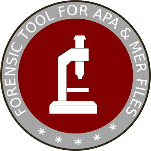
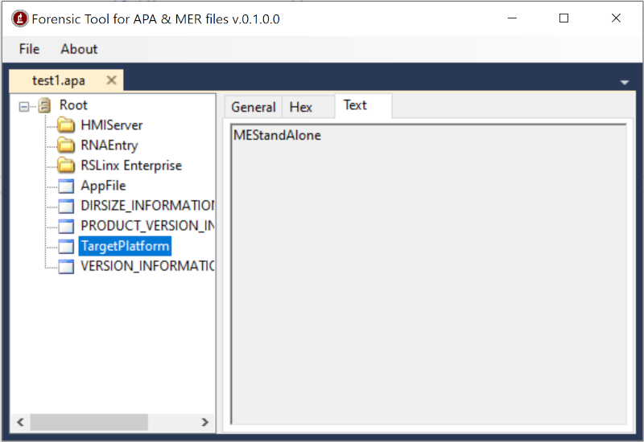
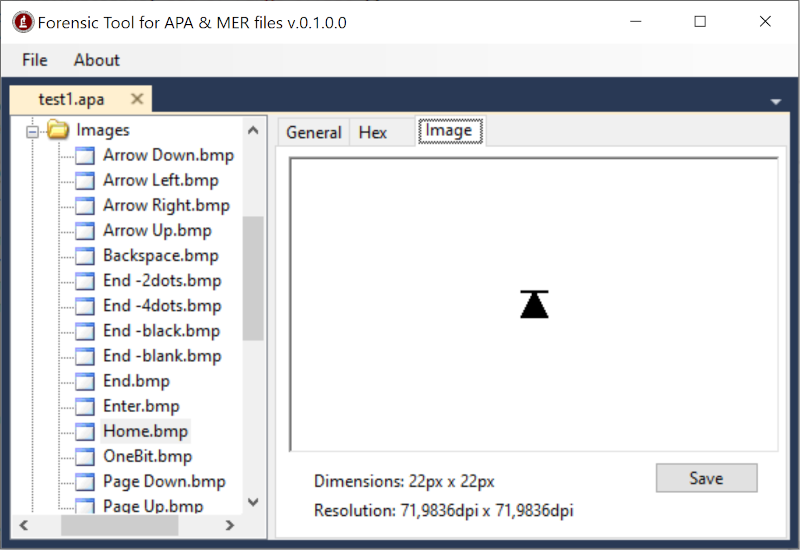
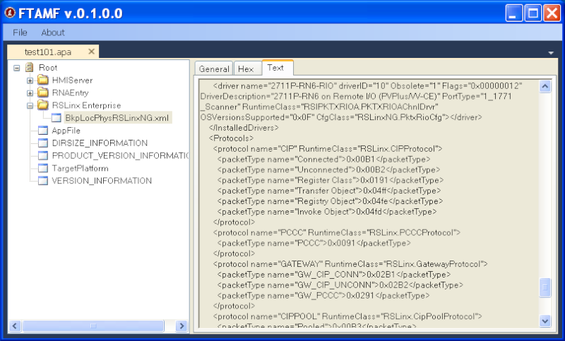

# FTAMF - Forensic Tool for APA & MER files

This tool allow you to analyze APA & MER files without having any RA FTView software installed.

## Background

Back in the days, I had to work with several old APA & MER files. It was tedious having to use virtual machines to simply extract some images or read basic information (versions, shortcuts). So I created a manual procedure to uncompress the files and get the information I needed. After some time, I started writing an application to automate the procedure. 

## How to use

This application is very straigthforward to use. Just go to File > Open and the popup window will allow to select a MER or APA file to analyze. It's you choose a valid file, a new tab will be shown in the application. 

*Figure 1: FTAMF getting target platform* 

At the left, there is a Treeview showing the elements contained in the file. Left click on each element to examine sub-elements. Depending of the selected element, you'll get different information on the right panel (general info, hex dump, text, image).

*Figure 2: FTAMF Extracting image*

There's a Save button in the Image tab (you have to select an image before getting this tab).

## Dependencies

The following Nuget Packages are needed to compile the project:

- DockPanelSuite by Weifen Luo
- OpenMcfd by ironfede

Two additional packages were added to be able to compile an standalone executable file:

- MSBuild.ILMerge.TAsk by Alexander Nosenko
- ILMerge by mbarnett

The project was originally created with Visual Studio Community 2019, using C# and .NET framework 4.5.2.

##  Binary files

Windows binaries are available in the Release section. Usually the same file is compiled to run on x86 and x64 machines.

## Version History

See [CHANGELOG.md](CHANGELOG.md).

## License

See [LICENSE](LICENSE.md).